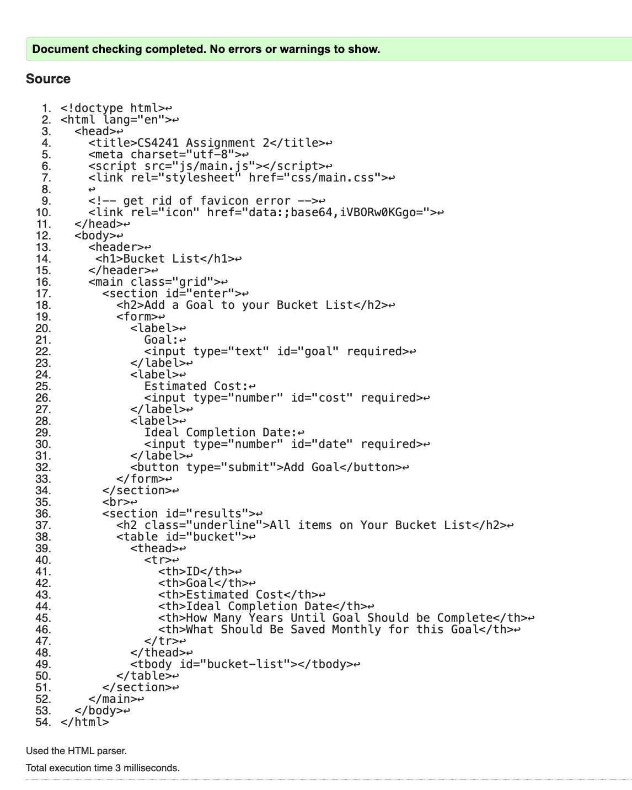
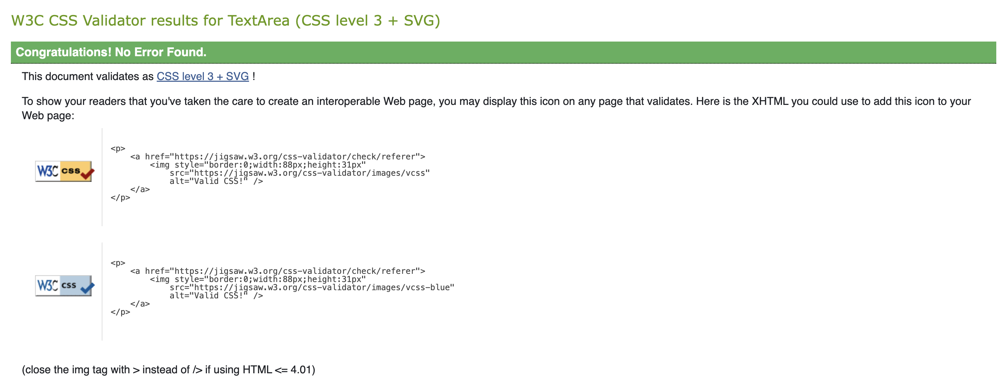

# Assignment 2 - Short Stack: Basic Two-tier Web Application using HTML/CSS/JS and Node.js  
Grace Robinson
http://a2-GraceRobinson.onrender.com

## Your Web Application Title: Bucket List
This application is a bucket list where the user can add the goal that they wish to have on their bucket list, the estimated cost of the goal, and the ideal year of completion for this goal. Once this goal is added two additional feilds are derived, how many years unitl the goal will be completed by and how much money should be saved up each month so that the user can reach the estimated cost by the year they want to complete this goal by. Another feature on this application is an update button that allows the user to update the goal, cost, and year of the goal, with the derived feilds updating automatically after the change. The user is also allowed to delete the goal that they make. The CSS positioning technique that used in this application is a grid to ensure that the place where the users enter stuff is above the place where the user can see the results.

## Technical Achievements
- **Tech Achievement 1**: Using a combination of add, update, and delete functionalities, I created a page that allows the user to customize their bucket list how they want. The add bunctionality allows the user to add a new goal to their bucket list along with the estimated cost of the goal and the desired year that they would like to get this goal done by. Once this goal is added to the server, it is displayed in a table on the same page alongside additional derived feilds. One of the additional fields includes how many years unitl the goal will be completed by. This is derived some taking the desired year of completion subtracted by the current year. The other dervied field is how much money should be saved up each month so that the user can reach the estimated cost by the year they want to complete this goal. This field is derived from taking the total estimated cost, and dividing it by the number of years until completing the goal multipled by 12. There is also a delete functionality where the user can delete the goal if they do not want it there any more or they have completed it. Additionally, an update functionality was added so that the user can change the goal, cost, and date for a desired goal that they would like to change. The derivied fiedls will then awtomatically update based on the change. All of this data is displayed on the page because of front end JS that gets the data. All vages were validated as well, which can be seen in the images below.

### Design/Evaluation Achievements
- **Design Achievement 1**: Some of the design achievements that I achieved are that I used HTML forms to create the spot where data is inputted. I also used elements, IDs, and class selectors in the HTML and CSS to improve organization and maintainability. The elements that I used include body, header, h1, label, table, thead, td, th, tr, button. The IDs that I used were #enter for the section where all of the input material was and then #results which is the section where all of the results are displayed. The class selectors I used were .grid, which is how I creaded the grid in the main part of the body, .underline, which is how I underlined the h2, .upd-btn, .upd-btn:hover, .del-btn, .del-btn:hover, which is how i created the different styles for the update and delete buttons. I also designed the page with a grid so that the input data section is above the results section.
- *Design/UX*
#### Arianna Xie
- Question: add a goal to the bucket list
  - added goal successfully 
  - got confused about the date and added the day instead of year, put ideal completion year was her comment
- Question: update goal
  - got confused how to just skip to a specific column to edit
  - but updated successfully
- Question: delete a goal
  - completed successfully 

#### Brandon Yeu
- Question: add a goal to the bucket list
  - added goal and cost but confused about date
- added goal
- Question: update goal
  - clicked button 
  - updated goal and cost and date but still put date in wrong
  - updated goal sucessfully
- Question: delete a goal
  - deleted goal successfully 

1. Provide the last name of each student you conduct the evaluation with.
  - Xie and Yeu
2. What problems did the user have with your design?
  - One of the problems that both users had with the design is that they both got confused about the correct way to add a date. They were confused on format about whether they had to enter a month, day, year. So, to fix this I made it so that the entry box says enter Ideal Completion Year. Another issue one of the users had is that they were confused how to skip certain areas after clicking update to update the goal. Sometimes the user only wanted to update the estimated cost of the goal and leave the goal itself and the year the same, however they got confused on how to do this so they both just update each area: goal, cost, year. So, to fix this I made it so there is a comment on the pop up that appears, telling the user that if they want to skip that area and leave it unchanged, they can just press cancel.
3. What comments did they make that surprised you?
  - I don't know if there were any comments that were super suprising. I think the comments that they made were super helpful because for the Ideal Completion Year for example, to me it was clear that I had to enter a year for the date but that is because I designed it. So, them making the comment about how they were confused made me realize that I could make that part a little bit more clear.
4. What would you change about the interface based on their feedback?
  - The two things that I would change, and did change, is the spot where they enter the date that they will ideally finish their goal by and making a clear indication that the user can press cancel if they would not like to update a certain area of the goal. Due to their confusion at these parts, I changed it so that the label for that box is now Ideal Completion Year and in the update pop up, it is indicated that the user should press cancel if they want to skip updating that particular part of the goal.
